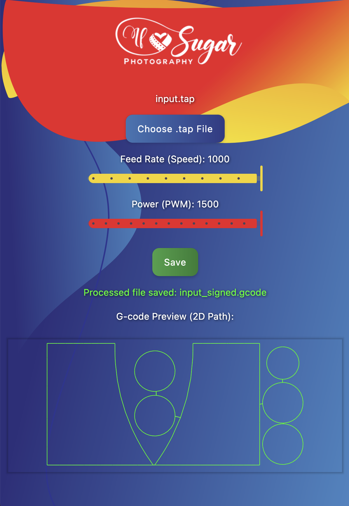

# 🧊 If Sugar Foam Cutter



**If Sugar Foam Cutter** is a lightweight Kotlin Compose Multiplatform desktop application for converting **`.tap` files** generated by **Docado FCNC** into **`.gcode` files** ready for foam cutting.

It supports:
- Choosing the **cutting speed (Feed Rate)**  
- Adjusting the **cutting rope power (PWM / how hot it should be)**  

---

## 🚀 Features

- Convert `.tap` files to `.gcode` automatically
- Select **feed rate** and **power** via a clean Compose UI
- Preview the generated file
- Built using **Kotlin 2.2.10** and **Compose Multiplatform 1.8.2**
- Cross-platform packaging: Windows `.msi`, macOS `.dmg`, and Linux `.deb` / `.rpm`

---

## 🧩 Example

### Input `.tap` file
Located at:  
`/composeApp/src/jvmTest/resources/file/input.tap`

Example:
```tap
('hidden\Splash arch - L1 D1 10cm.tap'. 509 lines of G-Code created on 9/11/2025 6:47:57 PM by FCNC.)

N00000 F500
N00010 M3 S300

N00020 G1 X24.21  Y37.87
N00030 G1 X70.10  Y37.87
N00040 G1 X115.99 Y37.87
N00050 G1 X161.87 Y37.87
N00060 G1 X207.76 Y37.87
N00070 G1 X207.76 Y37.87
N00080 G1 X221.15 Y37.87
N00090 G1 X267.04 Y37.87
# instuctions skipped for readibily
N03430 G1 X419.69 Y460.59
N03440
N03450 G1 X419.69 Y460.59
N03460 G1 X406.59 Y458.63
N03470 G1 X394.34 Y454.60
N03480 G1 X383.06 Y448.55
N03490 G1 X372.84 Y440.52
N03500 G1 X372.84 Y440.52
N03510 G1 X370.07 Y437.82
N03520 G1 X362.58 Y428.84
N03530 G1 X356.66 Y418.96
N05040
N05050
(EOF)
````

### Output `.gcode` file

Located at:
`/composeApp/src/jvmTest/resources/file/output.gcode`

Example:

```gcode
G4 P1 (Wait 1 seconds)
$H
M3 S1000
G4 P5 (Wait 5 seconds)
G21 (All units in mm)
G1 F1000
(Start Cutting GCODE)
G1 X24.21  Y37.87
G1 X70.10  Y37.87
G1 X115.99 Y37.87
G1 X161.87 Y37.87
G1 X207.76 Y37.87
G1 X207.76 Y37.87
G1 X221.15 Y37.87
G1 X267.04 Y37.87
(instuctions skipped for readibily)
G1 X419.69 Y460.59
G1 X419.69 Y460.59
G1 X406.59 Y458.63
G1 X394.34 Y454.60
G1 X383.06 Y448.55
G1 X372.84 Y440.52
G1 X372.84 Y440.52
G1 X370.07 Y437.82
G1 X362.58 Y428.84
G1 X356.66 Y418.96
(End Cutting GCODE)
G1 X0.00 Y0.00
M5 (WIRE OFF)
M2
(EOF)
```

---

## 🛠️ Build Instructions

### Prerequisites

* **JDK 21+**
* **Gradle** (comes with the project)
* **Kotlin 2.2.10**
* **Compose Multiplatform 1.8.2**

### Build the app (for development)

```bash
./gradlew build
```

### Run the app

```bash
./gradlew :composeApp:run
```

---

## 📦 Packaging (Distributables)

Compose Multiplatform supports building native installers.

### 🪟 Windows – Create `.msi`

```bash
./gradlew packageMsi
```

This generates an MSI installer at:

```
composeApp/build/compose/binaries/main-release/msi/
```

### 🍏 macOS – Create `.dmg`

```bash
./gradlew packageDmg
```

This generates a DMG installer at:

```
composeApp/build/compose/binaries/main-release/dmg/
```

### 🐧 Linux – Create .deb or .rpm

For Debian/Ubuntu:
```bash
./gradlew packageDeb
```

This generates a DEB package at:
```
composeApp/build/compose/binaries/main-release/deb/
```

For Fedora/openSUSE:
```bash
./gradlew packageRpm
```

This generates a RPM package at:
```
composeApp/build/compose/binaries/main-release/rpm/
```
---

## 📁 Project Structure

```
if-sugar-foam-cutter/
 ├─ composeApp/
 │   ├─ src/
 │   │   ├─ jvmMain/
 │   │   │   ├─ kotlin/            # Kotlin source files
 │   │   │   ├─ composeResources/  # Background, logos, etc.
 │   │   │   └─ resources          # Icons, native libs
 │   │   └─ jvmTest/resources/     # Test input/output samples
 │   └─ build.gradle.kts           # The main build file - deps, version, etc.
 ├─ demo.png
 ├─ README.md
 └─ build.gradle.kts               # General build oonfig - plugins, etc.
```

---

## 🧠 License

[MIT License © 2025](LICENSE)

Created by **Scoty** — powered by Kotlin & Compose Multiplatform.

---